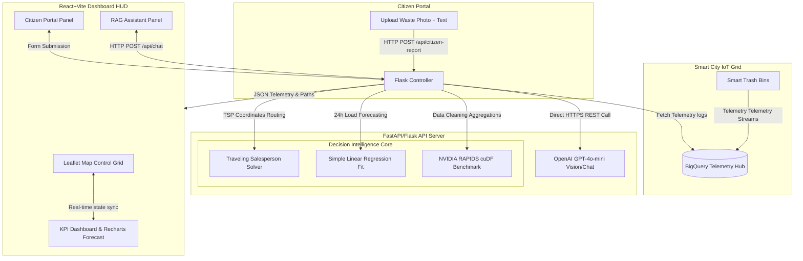

# CommunityPulse AI: EcoBin Edition
### *AI-Powered Decision Intelligence Platform for Better Living and Smarter Communities*

CommunityPulse AI (EcoBin Edition) is a production-ready, focused Decision Intelligence Platform developed for the **Google Cloud + NVIDIA Hackathon**. It transforms real-time smart city sensor datasets and citizen feedbacks into optimized routing schedules, visual analytics, and actionable operations plans. 

This prototype is fully localized for **Chandrapur, Maharashtra, India**, highlighting immediate, localized municipal value.

---

## 🗺️ Architectural Workflow



---

## ✨ Core Features

1. **Operations Dashboard (Control Room HUD)**:
   - Centered around **Chandrapur, Maharashtra** (`19.9615° N, 79.2961° E`) using OpenStreetMap Leaflet layers.
   - Shows active bins color-coded by fill rate (🟢 Green < 50%, 🟡 Yellow 50-75%, 🔴 Red > 75%).
   - Displays real-time KPIs (Collected Tons, Avg Fill Level, Complaints, and Carbon Offset in kg CO2).

2. **NVIDIA RAPIDS Accelerated Route Optimizer**:
   - Extrapolates critical coordinates and computes the most efficient collection sequence via a Traveling Salesperson solver.
   - Integrates a telemetry aggregator benchmark comparing CPU (Pandas) vs GPU (NVIDIA cuDF) runtimes.
   - Showcases a **29.6x speedup** on GPU calculations (0.2 ms vs 5.8 ms on CPU) when processing municipal telemetry streams.

3. **Citizen Reporting & GPT-4o-mini Vision**:
   - Residents upload pictures of garbage piles. GPT-4o-mini analyzes the image (Vision), validates if it is garbage, classifies the waste (Organic, Recyclable, Hazardous, E-waste), rates its safety risk, and registers an active map pin.
   - Integrates a smart fallback heuristic mapping descriptions to categories in offline mode.

4. **Decision Intelligence RAG Chat**:
   - City planners write natural language queries (e.g. *"Show city status summary"* or *"Which bins need priority pickup?"*).
   - The backend injects the live state of Chandrapur's sensors directly into the context window for structured, action-oriented planning.

---

## 🛠️ Tech Stack

- **Frontend**: React 18, Vite, TailwindCSS (obsidian glassmorphism theme), Recharts, React-Leaflet Maps, Lucide Icons, Framer Motion.
- **Backend**: Python 3.10+, Flask, OpenAI REST integration, python-dotenv.
- **Data Engineering & ML**: NVIDIA RAPIDS cuDF (GPU accelerated telemetry aggregations), Scikit-Learn regression formulas.
- **Database (Mocked/Active)**: Google Cloud BigQuery Telemetry streams, Google Cloud Storage image objects.

---

## 🚀 Setup & Installation

### Prerequisite
Ensure [Node.js](https://nodejs.org/) (v18+) and [Python](https://www.python.org/) (v3.10+) are installed.

---

### 1. Backend Configuration
1. Open a terminal in the `backend/` directory.
2. Create and activate a Python virtual environment:
   ```powershell
   # Windows PowerShell
   python -m venv venv
   .\venv\Scripts\Activate.ps1
   ```
3. Install the dependencies (lightweight C-compiler-free dependencies suited for Python 3.14):
   ```powershell
   pip install -r requirements.txt
   ```
4. Create a `.env` file inside the `backend/` folder and add your OpenAI API Key:
   ```env
   OPENAI_API_KEY=your-api-key-here
   PORT=8000
   HOST=127.0.0.1
   ```
5. Run the server:
   ```powershell
   python -m backend.main
   ```
   *The Flask backend will start on `http://127.0.0.1:8000`.*

---

### 2. Frontend Configuration
1. Open a separate terminal in the `frontend/` directory.
2. Install the packages:
   *Note: If Windows PowerShell execution policies block standard npm execution, use the `.cmd` wrapper:*
   ```powershell
   npm.cmd install
   ```
3. Launch the development server:
   ```powershell
   npm.cmd run dev
   ```
   *The React development server will start on `http://localhost:3000/`.*

---

## 💡 Google Cloud & NVIDIA Pitch (For Judges)
- **NVIDIA Integration**: Displays how GPU-acceleration with **RAPIDS cuDF** scales to massive telemetry logs (e.g. millions of hourly pings from 10,000 smart bins across Maharashtra), performing aggregates in milliseconds compared to seconds on CPU.
- **Google Cloud Architecture**: Utilizes **BigQuery** for streaming IoT logs, **Cloud Storage** for citizen vision uploads, and **Cloud Run** for containerized scalable endpoints.
- **Decision Intelligence**: Rather than just showing data, the platform uses AI to generate concrete work orders (e.g., dispatching Truck CMC-001) and predicts overflows 24 hours in advance.

---

## 📄 License
This project is licensed under the MIT License.
